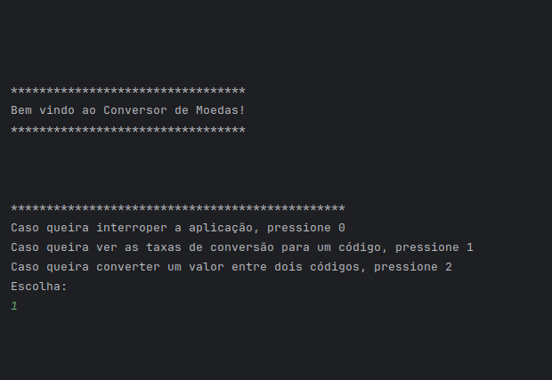
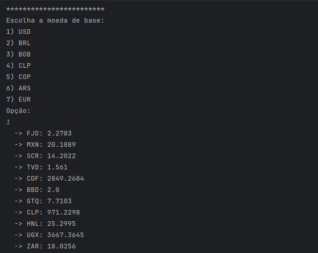
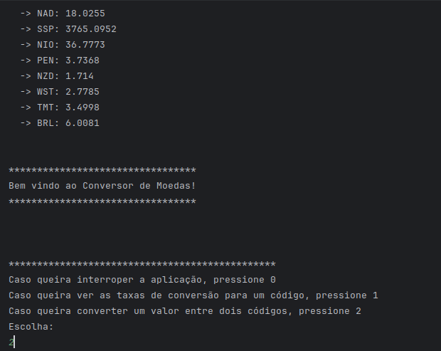
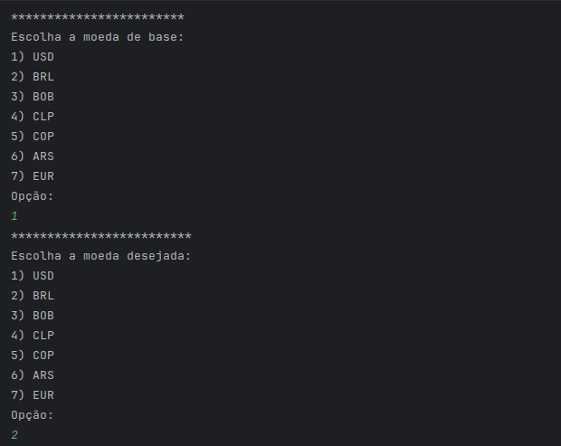
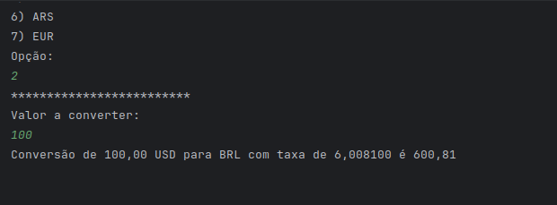

# Conversor de Moedas

## Descrição 
Projeto em linha de comando pedido como 1º Desafio Backend no programa Oracle Next Education. 
O objetivo é realizar uma conexão com uma API para obter dados de taxas de conversão de moedas em tempo real.

A API utilizada é a [ExchangeRate API](https://www.exchangerate-api.com/)

## Funcionalidades
- `Funcionalidade 1`: Listar as taxas de conversão da uma moeda para todas as outras moedas fornecidas pela API;
- `Funcionalidade 2`: Converter um valor fornecido pelo usuário entre duas moedas escolhidas.

## Técnicas e Tecnologias utilizadas
- `Java`
- `Paradigma de Orientação a Objetos`
- `Gson`
- `Intellij IDEA`

## Funcionamento

...

